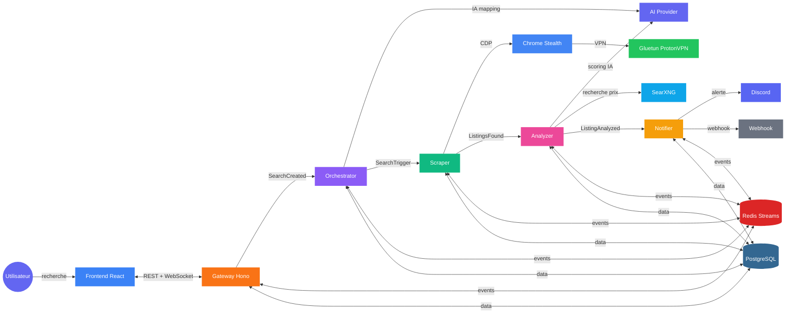

<div align="center">


# BonPlan

**Trouve les meilleures affaires sur LeBonCoin, automatiquement.**

Plateforme de veille intelligente qui scrape, analyse et score les annonces en temps reel grace a l'IA.

[](https://github.com/CharlesBinard/BonPlan/actions/workflows/ci.yml)
[](https://www.typescriptlang.org/)
[](https://bun.sh/)
[](https://hono.dev/)
[](LICENSE)
[](https://github.com/CharlesBinard/BonPlan/pulls)

</div>

---

## Comment ca marche



## Fonctionnalites

- **Recherche intelligente** — Decris ce que tu cherches en langage naturel, l'IA genere les bons mots-cles et criteres de jugement
- **Scraping stealth** — Chrome reel en mode headed derriere un VPN, indistinguable d'un vrai utilisateur
- **Scoring IA** — Chaque annonce est analysee et notee de 0 a 100 avec estimation du prix marche
- **Alertes temps reel** — Notifications Discord et webhooks des qu'une bonne affaire est detectee
- **Multi-provider IA** — Claude, OpenAI, Gemini ou Minimax selon ta preference
- **Dashboard** — Interface React moderne avec suivi des recherches, favoris et historique

## Architecture

Monorepo event-driven avec 8 packages communiquant via Redis Streams :

| Package | Role | Runtime |
|---------|------|---------|
| **[gateway](packages/gateway)** | API REST OpenAPI + WebSocket + static frontend | Bun |
| **[orchestrator](packages/orchestrator)** | Mapping IA des recherches + scheduling | Bun |
| **[scraper](packages/scraper)** | Scraping LeBonCoin via Patchright/CDP | Node |
| **[analyzer](packages/analyzer)** | Scoring IA + recherche de prix marche | Bun |
| **[notifier](packages/notifier)** | Discord bot + webhooks | Bun |
| **[frontend](packages/frontend)** | SPA React + TanStack Router | Vite |
| **[shared](packages/shared)** | Schema DB, events Redis, types, crypto | Bun |
| **[ai](packages/ai)** | Wrapper Vercel AI SDK multi-provider | Bun |

## Stack technique

<table>
<tr>
<td align="center" width="140"><strong>Runtime</strong></td>
<td>


</td>
</tr>
<tr>
<td align="center"><strong>Backend</strong></td>
<td>


</td>
</tr>
<tr>
<td align="center"><strong>Frontend</strong></td>
<td>


</td>
</tr>
<tr>
<td align="center"><strong>Data</strong></td>
<td>


</td>
</tr>
<tr>
<td align="center"><strong>IA</strong></td>
<td>


</td>
</tr>
<tr>
<td align="center"><strong>Infra</strong></td>
<td>


</td>
</tr>
</table>

## Demarrage rapide

### Prerequis

- [Bun](https://bun.sh/) >= 1.3
- [Docker](https://docs.docker.com/get-docker/) + Docker Compose
- Une cle API IA (Claude, OpenAI, ou Gemini)

### Installation

```bash
# Cloner le repo
git clone https://github.com/CharlesBinard/BonPlan.git
cd BonPlan

# Installer les dependances
bun install

# Configurer l'environnement
cp .env.example .env
# Editer .env avec tes secrets (voir .env.example pour les instructions)

# Lancer l'infrastructure (Postgres, Redis, Chrome, SearXNG)
docker compose up -d

# Lancer les migrations DB
bun run db:migrate

# Lancer tous les services en dev
bun run dev
```

L'app est accessible sur `http://localhost:5173` (frontend) et `http://localhost:3000` (API).

### Commandes utiles

```bash
bun run dev              # Tous les services via mprocs (TUI)
bun run dev:frontend     # Frontend seul
bun run dev:backend      # Backend services seuls
bun run check            # Biome lint + format
bun run check:fix        # Auto-fix lint + format
bun run test             # Tests (Bun test runner)
bun run typecheck        # TypeScript strict
bun run db:generate      # Generer une migration Drizzle
bun run db:migrate       # Appliquer les migrations
bun run db:studio        # Drizzle Studio (GUI)
bun run infra:up         # Docker compose up
bun run infra:down       # Docker compose down
```

## Deploiement

Le projet inclut un `docker-compose.prod.yml` et des Dockerfiles par service dans `docker/`. Compatible avec [Coolify](https://coolify.io/), Portainer, ou tout orchestrateur Docker.

```bash
# Production avec Cloudflare Tunnel
docker compose -f docker-compose.prod.yml up -d
```

Variables requises : voir [`.env.example`](.env.example).

## Contribuer

Les contributions sont les bienvenues ! Voir les [issues ouvertes](https://github.com/CharlesBinard/BonPlan/issues) pour les taches disponibles.

1. Fork le repo
2. Cree ta branche (`git checkout -b feat/ma-feature`)
3. Commit tes changements (`git commit -m 'feat: ajout de ma feature'`)
4. Push (`git push origin feat/ma-feature`)
5. Ouvre une Pull Request

Le CI verifie automatiquement : typecheck, lint (Biome), tests, et build frontend.

## License

Distribue sous licence MIT. Voir [`LICENSE`](LICENSE) pour plus d'informations.

---

<div align="center">

Fait avec :coffee: par [Charles Binard](https://github.com/CharlesBinard)

</div>
